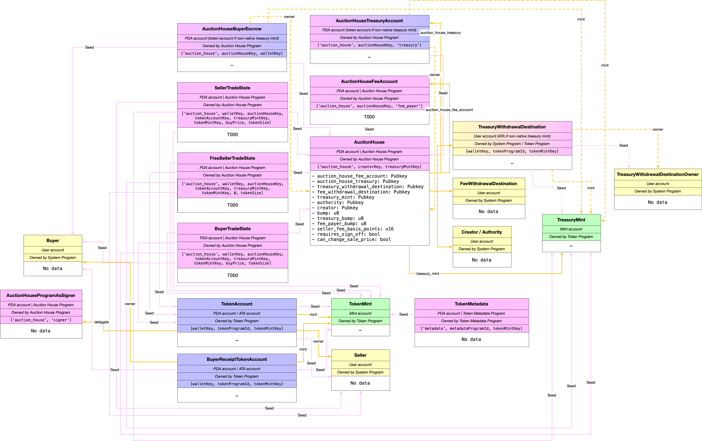

# Auction House

## 0. List of instructions

1. `withdraw_from_fee`
2. `withdraw_from_treasury`
3. `update_auction_house`
4. `create_auction_house`
5. `withdraw`
6. `deposit`
7. `cancel`
8. `execute_sale`
9. `sell`
10. `buy`

## Misc notes

`fee_payer` is used to pay rent fees on behalf of the end user.

## Diagram




## Walkthrough of the buy/sell flow

### 1. Creating the auction house

Here's how this instruction works:
1. First, a bunch of fields are set on the `auction_house` account. E.g. `auction_house.bump = bump`
2. Next, `create_program_token_account_if_not_present` is called
	* If the treasury mint is SOL (native), it's a no-op
	* If the treasury mint is an SPL token (non-native), and the auction house treasury has not been initialized, it initializes the account (it's a token account)
3. Next, the behavior branches again, depending on if the treasury mint is SOL
	* If the treasury mint is SOL (native), the program just asserts that `treasury_withdrawal_destination === treasury_withdrawal_destination_owner`
	* If the treasury mint is an SPL token (non-native), then an ATA with the address of `treasury_withdrawal_destination` is created. The program then asserts that `treasury_withdrawal_destination` is indeed a valid ATA

Here's the function signature:

```rust
pub fn create_auction_house<'info>(
    ctx: Context<'_, '_, '_, 'info, CreateAuctionHouse<'info>>,
    bump: u8,
    fee_payer_bump: u8,
    treasury_bump: u8,
    seller_fee_basis_points: u16,
    requires_sign_off: bool,
    can_change_sale_price: bool,
) -> ProgramResult {
    ...
}
```

Here are the accounts that get passed in:

```rust
#[derive(Accounts)]
#[instruction(bump: u8, fee_payer_bump: u8, treasury_bump: u8)]
pub struct CreateAuctionHouse<'info> {
    treasury_mint: Account<'info, Mint>,
    payer: Signer<'info>,
    authority: UncheckedAccount<'info>,
    #[account(mut)]
    fee_withdrawal_destination: UncheckedAccount<'info>,
    #[account(mut)]
    treasury_withdrawal_destination: UncheckedAccount<'info>,
    treasury_withdrawal_destination_owner: UncheckedAccount<'info>,
    #[account(init, seeds=[PREFIX.as_bytes(), authority.key().as_ref(), treasury_mint.key().as_ref()], bump=bump, space=AUCTION_HOUSE_SIZE, payer=payer)]
    auction_house: Account<'info, AuctionHouse>,
    #[account(mut, seeds=[PREFIX.as_bytes(), auction_house.key().as_ref(), FEE_PAYER.as_bytes()], bump=fee_payer_bump)]
    auction_house_fee_account: UncheckedAccount<'info>,
    #[account(mut, seeds=[PREFIX.as_bytes(), auction_house.key().as_ref(), TREASURY.as_bytes()], bump=treasury_bump)]
    auction_house_treasury: UncheckedAccount<'info>,
    token_program: Program<'info, Token>,
    system_program: Program<'info, System>,
    ata_program: Program<'info, AssociatedToken>,
    rent: Sysvar<'info, Rent>,
}
```

And here's what's stored in the account:

```rust
#[account]
pub struct AuctionHouse {
    pub auction_house_fee_account: Pubkey,
    pub auction_house_treasury: Pubkey,
    pub treasury_withdrawal_destination: Pubkey,
    pub fee_withdrawal_destination: Pubkey,
    pub treasury_mint: Pubkey,
    pub authority: Pubkey,
    pub creator: Pubkey,
    pub bump: u8,
    pub treasury_bump: u8,
    pub fee_payer_bump: u8,
    pub seller_fee_basis_points: u16,
    pub requires_sign_off: bool,
    pub can_change_sale_price: bool,
}
```

### 2. Sell

Here's how this instruction works:

1. First, some validation. There are three scenarios in which `ErrorCode::SalesRequireSigner` is returned
	* **TODO**: fully understand why an error is returned in these scenarios
	* If the wallet is not a signer and the buy price is 0
	* If the wallet is not a signer, and the buy price is greater than 0, and `free_seller_trade_state` is empty
	*  If the wallet is not a signer, and the buy price is greater than 0, and `free_seller_trade_state` is not empty, and either `authority` is not a signer or the `auction_house` can't change the sale price
2.  Next, the `fee_payer` is found via `get_fee_payer` 
	*  If `authority` is a signer, the fee payer is `auction_house_fee_account`
	*  Else, if `wallet` is a signer, the fee payer is `wallet`
		*  In this scenario, if `auction_house.requires_sign_off` is true, an error is returned—`ErrorCode::CannotTakeThisActionWithoutAuctionHouseSignOff`
	*  Else, an error is returned—`ErrorCode::NoPayerPresent`
3.  Next, some more assertions
	*  First, the program makes sure `token_account` is an ATA for `token_account.mint` and the passed-in `wallet`
	*  Then, the program makes sure the `metadata` address is a valid PDA, and that it has been initialized
	*  Lastly, the program makes sure that `token_account.amount` is greater than or equal to `token_size` (otherwise, there are not enough tokens to be sold!)
4.  Finally, some action! If `wallet` is a signer, a CPI is made with `spl_token::instruction::approve`. This instruction approves `program_as_signer`, which is a PDA of the auction house program. Basically, this lets the auction house program transfer up to `token_size` number of tokens from the passed-in token account
5.  Lastly, if the `seller_trade_state` account is empty, the program creates or allocates the account. Note that `fee_payer` (as calculated above) pays for the account's rent. This means it's possible to create a marketplace that lets people list for free!

Here's the function signature:

```rust
pub fn sell<'info>(
    ctx: Context<'_, '_, '_, 'info, Sell<'info>>,
    trade_state_bump: u8,
    _free_trade_state_bump: u8,
    _program_as_signer_bump: u8,
    buyer_price: u64,
    token_size: u64,
) -> ProgramResult {
```

And here are the accounts that get passed in:

```rust
#[derive(Accounts)]
#[instruction(trade_state_bump: u8, free_trade_state_bump: u8, program_as_signer_bump: u8, buyer_price: u64, token_size: u64)]
pub struct Sell<'info> {
    wallet: UncheckedAccount<'info>,
    #[account(mut)]
    token_account: Account<'info, TokenAccount>,
    metadata: UncheckedAccount<'info>,
    authority: UncheckedAccount<'info>,
    #[account(seeds=[PREFIX.as_bytes(), auction_house.creator.as_ref(), auction_house.treasury_mint.as_ref()], bump=auction_house.bump, has_one=authority, has_one=auction_house_fee_account)]
    auction_house: Account<'info, AuctionHouse>,
    #[account(mut, seeds=[PREFIX.as_bytes(), auction_house.key().as_ref(), FEE_PAYER.as_bytes()], bump=auction_house.fee_payer_bump)]
    auction_house_fee_account: UncheckedAccount<'info>,
    #[account(mut, seeds=[PREFIX.as_bytes(), wallet.key().as_ref(), auction_house.key().as_ref(), token_account.key().as_ref(), auction_house.treasury_mint.as_ref(), token_account.mint.as_ref(), &buyer_price.to_le_bytes(), &token_size.to_le_bytes()], bump=trade_state_bump)]
    seller_trade_state: UncheckedAccount<'info>,
    #[account(mut, seeds=[PREFIX.as_bytes(), wallet.key().as_ref(), auction_house.key().as_ref(), token_account.key().as_ref(), auction_house.treasury_mint.as_ref(), token_account.mint.as_ref(), &0u64.to_le_bytes(), &token_size.to_le_bytes()], bump=free_trade_state_bump)]
    free_seller_trade_state: UncheckedAccount<'info>,
    token_program: Program<'info, Token>,
    system_program: Program<'info, System>,
    #[account(seeds=[PREFIX.as_bytes(), SIGNER.as_bytes()], bump=program_as_signer_bump)]
    program_as_signer: UncheckedAccount<'info>,
    rent: Sysvar<'info, Rent>,
}
```

### 3. Buy

Here's how this instruction works:
1. First, the `fee_payer` is found via `get_fee_payer` 
2.  Next, `create_program_token_account_if_not_present` is called, and makes `escrow_payment_account` a token account if the treasury mint is non-native
3.  Then, the logic branches, depending on if the treasury mint is native. Both branches do basically the same thing—they transfer some assets to `escrow_payment_account` so it has enough to buy the item
	*  If it is native, then `escrow_payment_account` is topped off in SOL (i.e. some SOL is transferred to it so the account's balance is equal to `buyer_price`).
	*  Otherwise, `escrow_payment_account` is topped off with some SPL token, not SOL.
4.  Lastly, if the `buyer_trade_state` account is empty, the program creates or allocates the account. Note that `fee_payer` (as calculated above) pays for the account's rent. This means it's possible to create a marketplace that lets people submit bids for free!


Here's the function signature:

```rust
pub fn buy<'info>(
    ctx: Context<'_, '_, '_, 'info, Buy<'info>>,
    trade_state_bump: u8,
    escrow_payment_bump: u8,
    buyer_price: u64,
    token_size: u64,
) -> ProgramResult {
```

And here are the accounts that get passed in:

```rust
#[derive(Accounts)]
#[instruction(trade_state_bump: u8, escrow_payment_bump: u8, buyer_price: u64, token_size: u64)]
pub struct Buy<'info> {
    wallet: Signer<'info>,
    #[account(mut)]
    payment_account: UncheckedAccount<'info>,
    transfer_authority: UncheckedAccount<'info>,
    treasury_mint: Account<'info, Mint>,
    token_account: Account<'info, TokenAccount>,
    metadata: UncheckedAccount<'info>,
    #[account(mut, seeds=[PREFIX.as_bytes(), auction_house.key().as_ref(), wallet.key().as_ref()], bump=escrow_payment_bump)]
    escrow_payment_account: UncheckedAccount<'info>,
    authority: UncheckedAccount<'info>,
    #[account(seeds=[PREFIX.as_bytes(), auction_house.creator.as_ref(), auction_house.treasury_mint.as_ref()], bump=auction_house.bump, has_one=authority, has_one=treasury_mint, has_one=auction_house_fee_account)]
    auction_house: Account<'info, AuctionHouse>,
    #[account(mut, seeds=[PREFIX.as_bytes(), auction_house.key().as_ref(), FEE_PAYER.as_bytes()], bump=auction_house.fee_payer_bump)]
    auction_house_fee_account: UncheckedAccount<'info>,
    #[account(mut, seeds=[PREFIX.as_bytes(), wallet.key().as_ref(), auction_house.key().as_ref(), token_account.key().as_ref(), treasury_mint.key().as_ref(), token_account.mint.as_ref(), &buyer_price.to_le_bytes(), &token_size.to_le_bytes()], bump=trade_state_bump)]
    buyer_trade_state: UncheckedAccount<'info>,
    token_program: Program<'info, Token>,
    system_program: Program<'info, System>,
    rent: Sysvar<'info, Rent>,
}
```

### 4. Execute sale

Here's how this instruction works:
1. First, some verification is performed
	* If `buyer_price ===0`, and neither the `authority` or the `seller` are signers, an error is returned (`Cannot match free sales unless the auction house or seller signs off`)
	* The passed-in `token_mint` must match the mint of the passed-in `token_account`
	* The `token_account` must have a delegate, and the delegate must be `program_as_signer` (i.e. a PDA of the auction house)
	* Both `buyer_trade_state` and `seller_trade_state` must be non-empty
2. Then, the `fee_payer` is found via `get_fee_payer` 
3. Next, more verification
	* The `token_account` must be the seller's ATA
	* The `metadata` account must be a valid metadata PDA and non-empty
4. Next, `pay_creator_fees` is called. This function loops through all of the creators (`metadata.data.creators`) and pays them their share of the royalties (in either SOL or the `treasury_mint` token)
5. Next, `pay_auction_house_fees` pays the auction house (`auction_house_treasury`) its share (in either SOL or the `treasury_mint` token)
6. Next, the remaining funds are transferred to the seller
	* If the `treasury_mint` is native (SOL), then SOL is transferred to `seller_payment_receipt_account`. In this case, `seller_payment_receipt_account` must be equal to `seller`. The transfer instruction must be signed by `escrow_signer_seeds`
	* If the `treasury_mint` is not native, then the `treasury_mint` token is transferred to `seller_payment_receipt_account`. If `seller_payment_receipt_account` is empty, an ATA is created at that address. The transfer instruction must be signed by `ah_seeds` (because the auction house is the owner of `escrow_payment_account`)
7. Next, the NFT (or some token) is transferred to `buyer_receipt_token_account`. This is a two step process
	* If `buyer_receipt_token_account` is empty, an ATA is created at that address
	* Then, the NFT is transferred to `buyer_receipt_token_account`. The transfer instruction must be signed by `program_as_signer_seeds` (because `program_as_signer_seeds` is the delegate of `token_account`)
8. Finally, the program does some weird stuff. It manually increments/decrements the `lamports` fields of accounts. Specifically, it sets `seller_trade_state.lamports`, `buyer_trade_state.lamports`, and `free_trade_state.lamports` to `0`. And then it adds all those values to `fee_payer.lamports`.
	* Important note! The auction house program owns all of the `_trade_state` programs, but does not necessarily own `fee_payer`. However, any program is allowed to ADD lamports to an account. Only the owning program is allowed to SUBTRACT lamports. This was confusing me for a while....
	* The logic isn't the weird part, but idk why they do this stuff manually instead of using `transfer`.
	* Ok, I think I know why they do this instead of `transfer`. According to this [Discord message](https://discord.com/channels/428295358100013066/517163444747894795/913315349859024896), "only accounts owned by system program can use system program transfer." And since the ATAs aren't owned by the system program (but by the auction house), you can't use transfer with them.

Here's the function signature:

```rust
pub fn execute_sale<'info>(
    ctx: Context<'_, '_, '_, 'info, ExecuteSale<'info>>,
    escrow_payment_bump: u8,
    _free_trade_state_bump: u8,
    program_as_signer_bump: u8,
    buyer_price: u64,
    token_size: u64,
) -> ProgramResult {
```

And here are the accounts that get passed in:

```rust
#[derive(Accounts)]
#[instruction(escrow_payment_bump: u8, free_trade_state_bump: u8, program_as_signer_bump: u8, buyer_price: u64, token_size: u64)]
pub struct ExecuteSale<'info> {
    #[account(mut)]
    buyer: UncheckedAccount<'info>,
    #[account(mut)]
    seller: UncheckedAccount<'info>,
    // cannot mark these as real Accounts or else we blow stack size limit
    #[account(mut)]
    token_account: UncheckedAccount<'info>,
    token_mint: UncheckedAccount<'info>,
    metadata: UncheckedAccount<'info>,
    // cannot mark these as real Accounts or else we blow stack size limit
    treasury_mint: UncheckedAccount<'info>,
    #[account(mut, seeds=[PREFIX.as_bytes(), auction_house.key().as_ref(), buyer.key().as_ref()], bump=escrow_payment_bump)]
    escrow_payment_account: UncheckedAccount<'info>,
    #[account(mut)]
    seller_payment_receipt_account: UncheckedAccount<'info>,
    #[account(mut)]
    buyer_receipt_token_account: UncheckedAccount<'info>,
    authority: UncheckedAccount<'info>,
    #[account(seeds=[PREFIX.as_bytes(), auction_house.creator.as_ref(), auction_house.treasury_mint.as_ref()], bump=auction_house.bump, has_one=authority, has_one=treasury_mint, has_one=auction_house_treasury, has_one=auction_house_fee_account)]
    auction_house: Account<'info, AuctionHouse>,
    #[account(mut, seeds=[PREFIX.as_bytes(), auction_house.key().as_ref(), FEE_PAYER.as_bytes()], bump=auction_house.fee_payer_bump)]
    auction_house_fee_account: UncheckedAccount<'info>,
    #[account(mut, seeds=[PREFIX.as_bytes(), auction_house.key().as_ref(), TREASURY.as_bytes()], bump=auction_house.treasury_bump)]
    auction_house_treasury: UncheckedAccount<'info>,
    #[account(mut, seeds=[PREFIX.as_bytes(), buyer.key().as_ref(), auction_house.key().as_ref(), token_account.key().as_ref(), auction_house.treasury_mint.as_ref(), token_mint.key().as_ref(), &buyer_price.to_le_bytes(), &token_size.to_le_bytes()], bump=buyer_trade_state.to_account_info().data.borrow()[0])]
    buyer_trade_state: UncheckedAccount<'info>,
    #[account(mut, seeds=[PREFIX.as_bytes(), seller.key().as_ref(), auction_house.key().as_ref(), token_account.key().as_ref(), auction_house.treasury_mint.as_ref(), token_mint.key().as_ref(), &buyer_price.to_le_bytes(), &token_size.to_le_bytes()], bump=seller_trade_state.to_account_info().data.borrow()[0])]
    seller_trade_state: UncheckedAccount<'info>,
    #[account(mut, seeds=[PREFIX.as_bytes(), seller.key().as_ref(), auction_house.key().as_ref(), token_account.key().as_ref(), auction_house.treasury_mint.as_ref(), token_mint.key().as_ref(), &0u64.to_le_bytes(), &token_size.to_le_bytes()], bump=free_trade_state_bump)]
    free_trade_state: UncheckedAccount<'info>,
    token_program: Program<'info, Token>,
    system_program: Program<'info, System>,
    ata_program: Program<'info, AssociatedToken>,
    #[account(seeds=[PREFIX.as_bytes(), SIGNER.as_bytes()], bump=program_as_signer_bump)]
    program_as_signer: UncheckedAccount<'info>,
    rent: Sysvar<'info, Rent>,
}
```


## Other instructions

### Withdraw from fee
This instruction is quite simple—it transfers funds from `auction_house_fee_account` to `fee_withdrawal_destination`. Since `auction_house_fee_account` is a PDA, the program signs with its seeds. Note that fees are always paid in SOL, so there's no need to add an `is_native` check for this.

TODO: The thing I'm confused about—when does `auction_house_fee_account` accumulate funds? It seems like the whole point of the account is to pay fees on behalf of the buyer and seller... Hmmm, I think I understand. In order for the `auction_house_fee_account` to actually pay fees, you need to send it some SOL. However, without the `withdraw_from_fee` instruction, you'd have no way of getting those funds back!

Here's the function signature:

```rust
pub fn withdraw_from_fee<'info>(
    ctx: Context<'_, '_, '_, 'info, WithdrawFromFee<'info>>,
    amount: u64,
) -> ProgramResult {
```


And here are the accounts that get passed in:

```rust
#[derive(Accounts)]
pub struct WithdrawFromFee<'info> {
    authority: Signer<'info>,
    #[account(mut)]
    fee_withdrawal_destination: UncheckedAccount<'info>,
    #[account(mut, seeds=[PREFIX.as_bytes(), auction_house.key().as_ref(), FEE_PAYER.as_bytes()], bump=auction_house.fee_payer_bump)]
    auction_house_fee_account: UncheckedAccount<'info>,
    #[account(mut, seeds=[PREFIX.as_bytes(), auction_house.creator.as_ref(), auction_house.treasury_mint.key().as_ref()], bump=auction_house.bump, has_one=authority, has_one=fee_withdrawal_destination, has_one=auction_house_fee_account)]
    auction_house: Account<'info, AuctionHouse>,
    system_program: Program<'info, System>,
}
```

### Withdraw from treasury
This instruction is also quite simple. It transfers funds from `auction_house_treasury` to `treasury_withdrawal_destination`. If the `treasury_mint` is native, then SOL is transferred. Otherwise, SPL tokens are transferred. In the former case, the transfer instruction is signed with `auction_house_treasury_seeds`. 

In the latter case, the transfer instruction is signed with `auction_house_seeds` (because in this case, `auction_house_treasury` is a token account whose owner is the auction house program).

Here's the function signature:

```rust
pub fn withdraw_from_treasury<'info>(
    ctx: Context<'_, '_, '_, 'info, WithdrawFromTreasury<'info>>,
    amount: u64,
) -> ProgramResult {
```

And here are the accounts that get passed in:

```rust
#[derive(Accounts)]
pub struct WithdrawFromTreasury<'info> {
    treasury_mint: Account<'info, Mint>,
    authority: Signer<'info>,
    #[account(mut)]
    treasury_withdrawal_destination: UncheckedAccount<'info>,
    #[account(mut, seeds=[PREFIX.as_bytes(), auction_house.key().as_ref(), TREASURY.as_bytes()], bump=auction_house.treasury_bump)]
    auction_house_treasury: UncheckedAccount<'info>,
    #[account(mut, seeds=[PREFIX.as_bytes(), auction_house.creator.as_ref(), treasury_mint.key().as_ref()], bump=auction_house.bump, has_one=authority, has_one=treasury_mint, has_one=treasury_withdrawal_destination, has_one=auction_house_treasury)]
    auction_house: Account<'info, AuctionHouse>,
    token_program: Program<'info, Token>,
    system_program: Program<'info, System>,
}
```

### Withdraw
This instruction withdraws funds from `escrow_payment_account` (the buyer escrow account) to some recipient address.

In order for this transaction to succeed, either `wallet` or `authority` must sign the transaction.

If the `treasury_mint` is native, it withdraws SOL to some wallet (whoever signed the transaction).

Else, if the `treasury_mint` is non-native, it first creates an ATA at `receipt_account`'s address, and then transfers SPL tokens to that ATA. `fee_payer` is used to pay the new account's rent.

Here's the function signature:

```rust
pub fn withdraw<'info>(
    ctx: Context<'_, '_, '_, 'info, Withdraw<'info>>,
    escrow_payment_bump: u8,
    amount: u64,
) -> ProgramResult {
```

And here are the accounts that get passed in:

```rust
#[derive(Accounts)]
#[instruction(escrow_payment_bump: u8)]
pub struct Withdraw<'info> {
    wallet: UncheckedAccount<'info>,
    #[account(mut)]
    receipt_account: UncheckedAccount<'info>,
    #[account(mut, seeds=[PREFIX.as_bytes(), auction_house.key().as_ref(), wallet.key().as_ref()], bump=escrow_payment_bump)]
    escrow_payment_account: UncheckedAccount<'info>,
    treasury_mint: Account<'info, Mint>,
    authority: UncheckedAccount<'info>,
    #[account(seeds=[PREFIX.as_bytes(), auction_house.creator.as_ref(), auction_house.treasury_mint.as_ref()], bump=auction_house.bump, has_one=authority, has_one=treasury_mint, has_one=auction_house_fee_account)]
    auction_house: Account<'info, AuctionHouse>,
    #[account(mut, seeds=[PREFIX.as_bytes(), auction_house.key().as_ref(), FEE_PAYER.as_bytes()], bump=auction_house.fee_payer_bump)]
    auction_house_fee_account: UncheckedAccount<'info>,
    token_program: Program<'info, Token>,
    system_program: Program<'info, System>,
    ata_program: Program<'info, AssociatedToken>,
    rent: Sysvar<'info, Rent>,
}
```

### Deposit
This instruction deposits funds to `escrow_payment_account` (the buy escrow account). Either SOL or an SPL token can be deposited—it depends on `treasury_mint`. An ATA is created at the `escrow_payment_account`'s address if SPL tokens are being transferred and the account does not already exist.

Here's the function signature:

```rust
pub fn deposit<'info>(
    ctx: Context<'_, '_, '_, 'info, Deposit<'info>>,
    escrow_payment_bump: u8,
    amount: u64,
) -> ProgramResult {
```

And here are the accounts that get passed in:

```rust
#[derive(Accounts)]
#[instruction(escrow_payment_bump: u8)]
pub struct Deposit<'info> {
    wallet: Signer<'info>,
    #[account(mut)]
    payment_account: UncheckedAccount<'info>,
    transfer_authority: UncheckedAccount<'info>,
    #[account(mut, seeds=[PREFIX.as_bytes(), auction_house.key().as_ref(), wallet.key().as_ref()], bump=escrow_payment_bump)]
    escrow_payment_account: UncheckedAccount<'info>,
    treasury_mint: Account<'info, Mint>,
    authority: UncheckedAccount<'info>,
    #[account(seeds=[PREFIX.as_bytes(), auction_house.creator.as_ref(), auction_house.treasury_mint.as_ref()], bump=auction_house.bump, has_one=authority, has_one=treasury_mint, has_one=auction_house_fee_account)]
    auction_house: Account<'info, AuctionHouse>,
    #[account(mut, seeds=[PREFIX.as_bytes(), auction_house.key().as_ref(), FEE_PAYER.as_bytes()], bump=auction_house.fee_payer_bump)]
    auction_house_fee_account: UncheckedAccount<'info>,
    token_program: Program<'info, Token>,
    system_program: Program<'info, System>,
    rent: Sysvar<'info, Rent>,
}
```

### Cancel
Remember how the `token_account` that holds the NFT(s) the seller is selling approves `program_as_signer` as a delegate, so that the auction house can transfer the NFTs on behalf of the user?

Well, this just revokes that approval. Simple as that.

Oh, and it also transfers SOL from `seller_trade_state` to `fee_payer`, because that account is no longer needed and can be garbage collected.

Here's the function signature:

```rust
pub fn cancel<'info>(
    ctx: Context<'_, '_, '_, 'info, Cancel<'info>>,
    _buyer_price: u64,
    _token_size: u64,
) -> ProgramResult {
```

And here are the accounts that get passed in:

```rust
#[derive(Accounts)]
#[instruction(buyer_price: u64, token_size: u64)]
pub struct Cancel<'info> {
    #[account(mut)]
    wallet: UncheckedAccount<'info>,
    #[account(mut)]
    token_account: Account<'info, TokenAccount>,
    token_mint: Account<'info, Mint>,
    authority: UncheckedAccount<'info>,
    #[account(seeds=[PREFIX.as_bytes(), auction_house.creator.as_ref(), auction_house.treasury_mint.as_ref()], bump=auction_house.bump, has_one=authority, has_one=auction_house_fee_account)]
    auction_house: Account<'info, AuctionHouse>,
    #[account(mut, seeds=[PREFIX.as_bytes(), auction_house.key().as_ref(), FEE_PAYER.as_bytes()], bump=auction_house.fee_payer_bump)]
    auction_house_fee_account: UncheckedAccount<'info>,
    #[account(mut, seeds=[PREFIX.as_bytes(), wallet.key().as_ref(), auction_house.key().as_ref(), token_account.key().as_ref(), auction_house.treasury_mint.as_ref(), token_mint.key().as_ref(), &buyer_price.to_le_bytes(), &token_size.to_le_bytes()], bump=trade_state.to_account_info().data.borrow()[0])]
    trade_state: UncheckedAccount<'info>,
    token_program: Program<'info, Token>,
}
```

### Update auction house

This instruction lets you update the following fields:
* `auction_house.seller_fee_basis_points`
* `auction_house.requires_sign_off`
* `auction_house.can_change_sale_price`
* `auction_house.authority`
* `auction_house.treasury_withdrawal_destination`
* `auction_house.fee_withdrawal_destination`

Here's the function signature:

```rust
pub fn update_auction_house<'info>(
    ctx: Context<'_, '_, '_, 'info, UpdateAuctionHouse<'info>>,
    seller_fee_basis_points: Option<u16>,
    requires_sign_off: Option<bool>,
    can_change_sale_price: Option<bool>,
) -> ProgramResult {
```

And here are the accounts that get passed in:

```rust
#[derive(Accounts)]
pub struct UpdateAuctionHouse<'info> {
    treasury_mint: Account<'info, Mint>,
    payer: Signer<'info>,
    authority: Signer<'info>,
    new_authority: UncheckedAccount<'info>,
    #[account(mut)]
    fee_withdrawal_destination: UncheckedAccount<'info>,
    #[account(mut)]
    treasury_withdrawal_destination: UncheckedAccount<'info>,
    treasury_withdrawal_destination_owner: UncheckedAccount<'info>,
    #[account(mut, seeds=[PREFIX.as_bytes(), auction_house.creator.as_ref(), treasury_mint.key().as_ref()], bump=auction_house.bump, has_one=authority, has_one=treasury_mint)]
    auction_house: Account<'info, AuctionHouse>,
    token_program: Program<'info, Token>,
    system_program: Program<'info, System>,
    ata_program: Program<'info, AssociatedToken>,
    rent: Sysvar<'info, Rent>,
}
```

