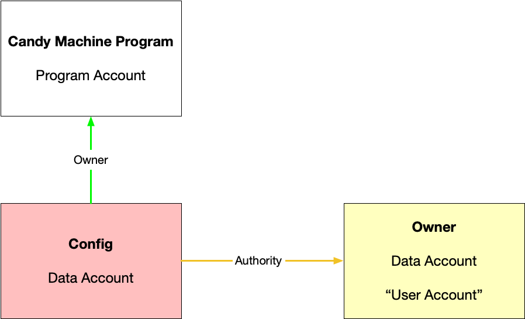
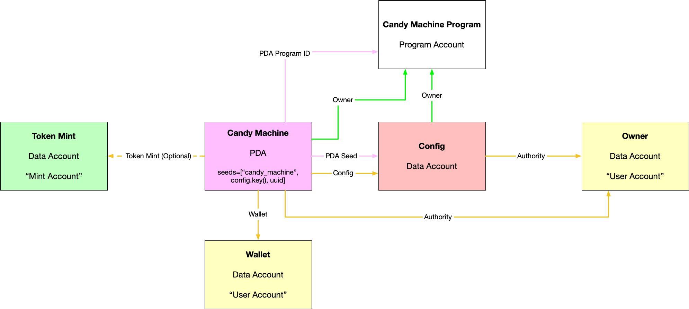
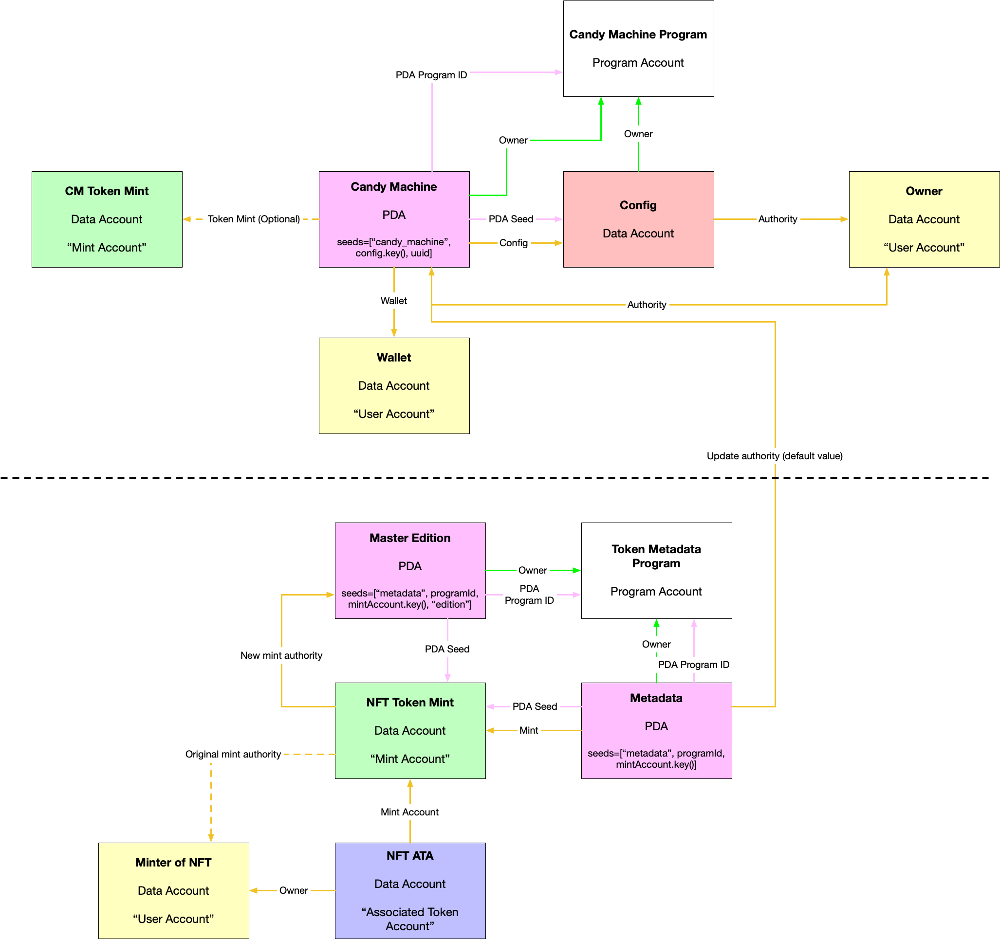

# A Simplified Explanation of Solana's Candy Machine

[Candy Machine](https://github.com/metaplex-foundation/metaplex/tree/master/rust/nft-candy-machine) is a Solana program that is commonly used to mint NFT collections on the Solana blockchain. This post is about how the Candy Machine program works, not about how to use Candy Machine to mint a collection (there are already plenty of resources about that).

There are four main steps involved to set up a Candy Machine.

1. First, you create an account that contains configuration data (e.g. the symbol of your NFTs). This is done by calling the `nft_candy_machine::initialize_config` instruction of the Candy Machine program.
2. Second, you add "config lines" to the config account. There's one line for each NFT in the collection, and each line contains the name of the asset and a URI pointing to its metadata. The `nft_candy_machine::add_config_lines` instruction does this.
2. Next, you create an account that contains the rest of the Candy Machine's info (e.g. the address of the wallet that minting proceeds should go to). This is done by calling the `nft_candy_machine::initialize_candy_machine` instruction of the Candy Machine program. I'm actually not sure why the configuration account is different from the Candy Machine account-maybe it's to work around size limitations?
3. Finally, when someone wants to mint an NFT, they call the `nft_candy_machine::mint_nft` instruction.

Let's go over each of these steps in more detail.

## 1. Creating the Config
`nft_candy_machine::initialize_config` initializes an account that contains the Candy Machine's configuration info. Note that the account must be created beforehand—this instruction just initializes the account's data.

Here's the function signature:

```rust
pub fn initialize_config(ctx: Context<InitializeConfig>, data: ConfigData) -> ProgramResult {
    ...
}
```

Here are the accounts that get passed in:


```rust
#[derive(Accounts)]
#[instruction(data: ConfigData)]
pub struct InitializeConfig<'info> {
    #[account(mut, constraint= config.to_account_info().owner == program_id && config.to_account_info().data_len() >= CONFIG_ARRAY_START+4+(data.max_number_of_lines as usize)*CONFIG_LINE_SIZE + 4 + (data.max_number_of_lines.checked_div(8).ok_or(ErrorCode::NumericalOverflowError)? as usize))]
    config: AccountInfo<'info>,
    #[account(constraint= authority.data_is_empty() && authority.lamports() > 0 )]
    authority: AccountInfo<'info>,
    #[account(mut, signer)]
    payer: AccountInfo<'info>,
}
```

And here's what actually stored in the config account:

```rust
#[account]
#[derive(Default)]
pub struct Config {
    pub authority: Pubkey,
    pub data: ConfigData,
    // there's a borsh vec u32 denoting how many actual lines of data there are currently (eventually equals max number of lines)
    // There is actually lines and lines of data after this but we explicitly never want them deserialized.
    // here there is a borsh vec u32 indicating number of bytes in bitmask array.
    // here there is a number of bytes equal to ceil(max_number_of_lines/8) and it is a bit mask used to figure out when to increment borsh vec u32
}

#[derive(AnchorSerialize, AnchorDeserialize, Clone, Default)]
pub struct ConfigData {
    pub uuid: String,
    /// The symbol for the asset
    pub symbol: String,
    /// Royalty basis points that goes to creators in secondary sales (0-10000)
    pub seller_fee_basis_points: u16,
    pub creators: Vec<Creator>,
    pub max_supply: u64,
    pub is_mutable: bool,
    pub retain_authority: bool,
    pub max_number_of_lines: u32,
}
```

Here's what the instruction looks like on [Solana Explorer](https://explorer.solana.com/tx/2vZzQg8uHa6HoQVu1QDDmARUqAuYotCtiFDq7NTTwEvtj1FsR2mCjnVaX9SXp6RKVFoKyuS2LkzuKZN58tMtQGiL?cluster=devnet). Note that the instruction's transaction also includes an instruction that creates the account (address `6eZ5ycD92Xw71kQFV1HQ5DV44KgeAAbA8dKnF25Xs73D`) and sets its owner to the Candy Machine program.

| Instruction # | Program | Instruction Name | Notes |
|:--|:--|:--|:--|
| 1 | System Program | Create Account | Creates the config account, sets its own to the Candy Machine program.
| 2 | Candy Machine Program | Initialize Config | Initializes the config account's data 

Finally, here's a diagram of all the accounts in play so far. It's quite simple for now.



## 2. Adding config lines
`nft_candy_machine::add_config_lines` adds lines to the config. There is one line per NFT. Each line contains the NFT's name and a URI pointing to its metadata.

Here's the function signature:

```rust
pub fn add_config_lines(
    ctx: Context<AddConfigLines>,
    index: u32,
    config_lines: Vec<ConfigLine>,
) -> ProgramResult {
    ...
}
```

Here are the accounts that get passed in:

```rust
#[derive(Accounts)]
pub struct AddConfigLines<'info> {
    #[account(mut, has_one = authority)]
    config: ProgramAccount<'info, Config>,
    #[account(signer)]
    authority: AccountInfo<'info>,
}
```

The config lines are stored in the config account, but since they're not meant to be deserialized, they don't appear in the Rust struct:

```rust
#[account]
#[derive(Default)]
pub struct Config {
    pub authority: Pubkey,
    pub data: ConfigData,
    // there's a borsh vec u32 denoting how many actual lines of data there are currently (eventually equals max number of lines)
    // There is actually lines and lines of data after this but we explicitly never want them deserialized.
    // here there is a borsh vec u32 indicating number of bytes in bitmask array.
    // here there is a number of bytes equal to ceil(max_number_of_lines/8) and it is a bit mask used to figure out when to increment borsh vec u32
}
```

Here's what this instruction looks like on [Solana Explorer](https://explorer.solana.com/tx/2mVeP6zirTHSVdrn3ixj1ApT5PSJ6ZPe2PkP7o8YTny3Tb3b4r22xJGVeTD5zPGMYpa5rWqyWCnHaJFAURvph6x7?cluster=devnet). 


| Instruction # | Program | Instruction Name |
|:--|:--|:--|
| 1 | Candy Machine Program | Add Config Lines |

If you copy/paste the instruction data into a [hex decoder](https://www.convertstring.com/EncodeDecode/HexDecode), you can see all the config lines. For example (from the Solana Explorer example):

```
ß2àã—sj
Rectangle NFT #1?https://arweave.net/RmOJijL57LWTYMSbOa_xRv0ib77svoSIFQLKjKOSk4ERectangle NFT #2?https://arweave.net/D8qFyBT-POVF8wCz9H19z9goVduaa4TqedYp33wnEB8Rectangle NFT #3?https://arweave.net/n-BpOn70TvpxQNucT5DyGpwlNt-sT78uBGcOfXWtefcRectangle NFT #4?
```

At this point, nothing has changed with our account diagram. The only difference is that the config account has had some data added to it.


## 3. Creating the Candy Machine
`nft_candy_machine::initialize_candy_machine` creates and initializes an account that contains more info about the Candy Machine. I'm not sure why this is separated from the config data, maybe to keep account sizes down?

Here's the function signature:

```rust
pub fn initialize_candy_machine(
    ctx: Context<InitializeCandyMachine>,
    bump: u8,
    data: CandyMachineData,
) -> ProgramResult {
    ...
}
```

Here are the accounts that get passed in:

```rust
#[derive(Accounts)]
#[instruction(bump: u8, data: CandyMachineData)]
pub struct InitializeCandyMachine<'info> {
    #[account(init, seeds=[PREFIX.as_bytes(), config.key().as_ref(), data.uuid.as_bytes()], payer=payer, bump=bump, space=8+32+32+33+32+64+64+64+200)]
    candy_machine: ProgramAccount<'info, CandyMachine>,
    #[account(constraint= wallet.owner == &spl_token::id() || (wallet.data_is_empty() && wallet.lamports() > 0) )]
    wallet: AccountInfo<'info>,
    #[account(has_one=authority)]
    config: ProgramAccount<'info, Config>,
    #[account(signer, constraint= authority.data_is_empty() && authority.lamports() > 0)]
    authority: AccountInfo<'info>,
    #[account(mut, signer)]
    payer: AccountInfo<'info>,
    #[account(address = system_program::ID)]
    system_program: AccountInfo<'info>,~~‌~~
}
```

And here's what's actually stored in the account:

```rust
#[account]
#[derive(Default)]
pub struct CandyMachine {
    pub authority: Pubkey,
    pub wallet: Pubkey,
    pub token_mint: Option<Pubkey>,
    pub config: Pubkey,
    pub data: CandyMachineData,
    pub items_redeemed: u64,
    pub bump: u8,
}

#[derive(AnchorSerialize, AnchorDeserialize, Clone, Default)]
pub struct CandyMachineData {
    pub uuid: String,
    pub price: u64,
    pub items_available: u64,
    pub go_live_date: Option<i64>,
}
```

Note that the account stores the config account's address (`Pubkey`).

Here's what the instruction looks like on [Solana Explorer](https://explorer.solana.com/tx/UKZ1D7s8WvvGPC381AG5btCLsBa2PpveoEwbBmb7Dmeg6DE9HgmaADftex2DF5g6KKVgVD7WYMEW5Qf31tVm6bW?cluster=devnet). 

| Instruction # | Program | Instruction Name | Notes |
|:--|:--|:--|:--|
| 1 | Candy Machine Program | Initialize Candy Machine | Creates the Candy Machine account and initializes its data.
| 1.1 | System Program | Create Account | Creates the Candy Machine account.

Finally, here's a diagram of all the accounts in play so far. It's starting to get more complicated... here are some things to note. 

* First, the token mint account (on the left) is optional. If it exists, it means the Candy Machine accepts payment in that token. Otherwise, the Candy Machine accepts payment in SOL.
* The Candy Machine's wallet is where minting proceeds go.
* The Candy Machine's authority is the only one allowed to modify the Candy Machine (e.g. update the go-live-date) via the Candy Machine program.




## 4. Minting an NFT
This is where it gets complicated. The `nft_candy_machine::mint_nft` instruction does exactly what you'd think—it mints an NFT to someone. But unlike the other instructions, it makes a bunch of CPIs (cross-program invocations) to Metaplex's token metadata program. That makes the logic a bit more difficult to track. We'll break it down more below.

Here's the function signature:

```rust
pub fn mint_nft<'info>(ctx: Context<'_, '_, '_, 'info, MintNFT<'info>>) -> ProgramResult     pub fn mint_nft<'info>(ctx: Context<'_, '_, '_, 'info, MintNFT<'info>>) -> ProgramResult {{
    ...
}
```

Here are the accounts that get passed in (it's a lot!):

```rust
#[derive(Accounts)]
pub struct MintNFT<'info> {
    config: Account<'info, Config>,
    #[account(
        mut,
        has_one = config,
        // Important! This ensures correct wallet is passed in
        has_one = wallet,
        seeds = [PREFIX.as_bytes(), config.key().as_ref(), candy_machine.data.uuid.as_bytes()],
        bump = candy_machine.bump,
    )]
    candy_machine: Account<'info, CandyMachine>,
    #[account(mut)]
    payer: Signer<'info>,
    #[account(mut)]
    wallet: UncheckedAccount<'info>,
    // With the following accounts we aren't using anchor macros because they are CPI'd
    // through to token-metadata which will do all the validations we need on them.
    #[account(mut)]
    metadata: UncheckedAccount<'info>,
    #[account(mut)]
    mint: UncheckedAccount<'info>,
    mint_authority: Signer<'info>,
    update_authority: Signer<'info>,
    #[account(mut)]
    master_edition: UncheckedAccount<'info>,
    #[account(address = metaplex_token_metadata::id())]
    token_metadata_program: UncheckedAccount<'info>,
    token_program: Program<'info, Token>,
    system_program: Program<'info, System>,
    rent: Sysvar<'info, Rent>,
    clock: Sysvar<'info, Clock>,
}
```

The accounts at the beginning should be pretty familiar. The accounts in the second half are for passing to the token metadata program.

Here's what the instruction looks like on [Solana Explorer](https://explorer.solana.com/tx/3m4X93TR8TJVE5dpvwgG9ej62JRZyiFXCypYEkqhwRvmuwTNsMtp2PR6Wjnv5pddEtLTYDMWSQoDH1yogGXgqjUN?cluster=devnet). Note that it's bundled with a bunch of other instructions (see [candy-machine-mint](https://github.com/exiled-apes/candy-machine-mint) for the source code).

| Instruction # | Program | Instruction Name | Notes |
|:--|:--|:--|:--|
| 1 | System Program | Create Account | Creates the mint account
| 2 | Token Program | Initialize Mint | Initializes the mint account (mint authority is person minting the NFT)
| 3 | Associated Token Program | Create | Creates an ATA for the mint account
| 3.1 | System Program | Transfer | Transfers SOL from the payer (person minting the NFT, owner of the ATA) to the ATA (needed for rent)
| 3.2 | System Program | Allocate Account | Allocates space for the ATA
| 3.3 | System Program | Assign Account | Makes the token program the owner of the ATA
| 3.4 | Token Program | Initialize Account | Initializes the ATA
| 4 | Token Program | Mint To | Mints a single token to the ATA created above. At this point in time, the mint authority is still the person minting the NFT. Hm, that's a bit redundant. You get it though. Also, note that if more than one is minted, an ix further down the line will fail.
| 5 | Candy Machine Program | Mint NFT | WARNING: has so many CPIs
| 5.1 | System Program | Transfer | Some amount of SOL is transferred from the minter to the treasury wallet (this is payment for the NFT).
| 5.2 | Token Metadata Program | Create Metadata Account | This creates a metadata account, which is a PDA that uses the mint account's address as a seed.
| 5.2.1 | System Program | Transfer | This transfers some SOL from the minter to the metadata account, in order for it to be rent exempt.
| 5.2.2 | System Program | Allocate Account | This allocates space for the metadata account.
| 5.2.3 | System Program | Assign Account | Makes the token metadata program the owner of the metadata account.
| 5.3 | Token Metadata Program | Create Master Edition | Creates a Master Edition PDA for the mint account. From the comments: "Henceforth, no further tokens will be mintable from this primary mint. Will throw an error if more than one token exists, and will throw an error if less than one token exists in this primary mint."
| 5.3.1 | System Program | Transfer | This transfers some SOL from the minter to the Master Edition account, in order for it to be rent exempt.
| 5.3.2 | System Program | Allocate Account | This allocates space for the Master Edition account.
| 5.3.3 | System Program | Assign Account | Makes the token metadata program the owner of the Master Edition account.
| 5.3.4 | Token Program | Set Authority | Sets the `mintTokens` authority of the mint account to the Master Edition PDA (preventing the original authority, the minter, from minting more NFTs).
| 5.3.5 | Token Program | Set Authority | Sets the `freeze` authority of the mint account to the Master Edition PDA.
| 5.4 | Token Metadata Program | Update Metadata Accounts | This updates the metadata account's data.

Phew, that was a lot.

There are two accounts we need to take a closer look at: the Metaplex token metadata account and the Metaplex master edition account. But first, let's look at how all the accounts in play are related. Here are some things to note:

* The top half of the diagram is the same as above. The bottom half is all the accounts used by Metaplex's token metadata program.
* The token metadata account is a PDA. It's connected to a token mint account (the mint account of the NFT) and an update authority. Only the update authority can update the metadata.
* The master edition account is also a PDA. When you mint an NFT with `nft_candy_machine::mint_nft`, a master edition account is created and gets set as the mint account's mint authority. This means that the only way to mint new NFTs is via the token metadata program (which will sign instructions with the master edition's PDA seeds). This prevents the original creator of the mint account from having full control over minting (e.g. it prevents them from minting many more NFTs).



Now let's take a closer look at the token metadata and master edition PDAs. Simply put, the metadata account stores the NFT's metadata (e.g. its symbol). Here's the data stored in the metadata account:

```rust
#[repr(C)]
#[derive(BorshSerialize, BorshDeserialize, PartialEq, Debug, Clone)]
pub struct Data {
    /// The name of the asset
    pub name: String,
    /// The symbol for the asset
    pub symbol: String,
    /// URI pointing to JSON representing the asset
    pub uri: String,
    /// Royalty basis points that goes to creators in secondary sales (0-10000)
    pub seller_fee_basis_points: u16,
    /// Array of creators, optional
    pub creators: Option<Vec<Creator>>,
}

#[repr(C)]
#[derive(Clone, BorshSerialize, BorshDeserialize, Debug)]
pub struct Metadata {
    pub key: Key,
    pub update_authority: Pubkey,
    pub mint: Pubkey,
    pub data: Data,
    // Immutable, once flipped, all sales of this metadata are considered secondary.
    pub primary_sale_happened: bool,
    // Whether or not the data struct is mutable, default is not
    pub is_mutable: bool,
    /// nonce for easy calculation of editions, if present
    pub edition_nonce: Option<u8>,
}
```

We can take a look at this [Degen Ape on Solana Explorer](https://explorer.solana.com/address/HRoxDQ7nHpejLgEFbdbDgs7b7VPAUZ6F3CTbNtTib8CL/metadata) to see some example metadata. Note that the URI stored in the metadata account ([https://arweave.net/2sidyd5iuw5q0yCaPYSWa9npKs7-wKlWmCdqt8uiZTE](https://arweave.net/2sidyd5iuw5q0yCaPYSWa9npKs7-wKlWmCdqt8uiZTE) in this example) points to a JSON file stored on Arweave that *also* stores the NFT's metadata. For example, the metadata stored on Arweave contains the NFT's name, description, and a link to its image—things that don't need to be accessed on-chain. The metadata account stores info that needs to be read/written on-chain, like how much royalties are distributed to the NFT's creators.

Here's the data stored in the master edition account:

```rust
#[repr(C)]
#[derive(Clone, Debug, PartialEq, BorshSerialize, BorshDeserialize)]
pub struct MasterEditionV2 {
    pub key: Key,

    pub supply: u64,

    pub max_supply: Option<u64>,
}
```

This is pretty simple. `supply` is how many copies (i.e. ["editions"](https://docs.metaplex.com/architecture/deep_dive/overview#edition) of the NFT can be made). `max_supply` is the max amount of copies allowed—if `max_supply === 0`, it means the NFT is a 1/1. 

There's one more thing I want to cover regarding master editions. The [`metaplex_token_metadata::process_create_master_edition`](https://github.com/metaplex-foundation/metaplex/blob/master/rust/token-metadata/program/src/processor.rs#L340-L342) function contains the following code: 

```rust 
if mint.supply != 1 {
    return Err(MetadataError::EditionsMustHaveExactlyOneToken.into());
}
```

In plain English, if the mint account passed to the `process_create_metadata_edition` instruction handler has a supply that's not equal to 1, the instruction fails (and therefore `nft_candy_machine::mint_nft` fails). As you can see, the [Degen Ape](https://explorer.solana.com/address/HRoxDQ7nHpejLgEFbdbDgs7b7VPAUZ6F3CTbNtTib8CL/metadata) we looked at above adheres to this rule. It wouldn't make sense for that Degen Ape mint to have a supply of 2 or more—this check prevents that from happening.

## Recap
Ok, that's all I wanted to cover (I guess it was kind of a lot though). Here's a quick recap:

1. Before minting starts for an NFT collection, the collection's creator must:
	2. Initialize a Candy Machine config account (stores config data about the Candy Machine)
	3. Initialize a Candy Machine account (stores more info about the Candy Machine). This is a PDA!
	4. Add lines to the config. Each line contains a single NFT's name and a link to its metadata.
5. Then, in order to mint an NFT from the Candy Machine, `nft_candy_machine::mint_instruction` is called. You can check out the [candy-machine-mint](https://github.com/exiled-apes/candy-machine-mint) repo to see an example of how this is done. That instruction will do the following:
	6. Transfer SOL/tokens from the minter to the Candy Machine's wallet (to pay for the NFT).
	7. Create a metadata PDA for the NFT's mint account (this marks it as a Metaplex NFT).
	8. Create a master edition PDA for the NFT's mint account (this controls how many copies of the NFT can be made).

Here's an even simpler explanation:

1. First, you tell the Candy Machine program to create a new Candy Machine account. This contains info like how many NFTs are available, and the price of the NFTs.
2. Then, when someone wants to mint an NFT from your Candy Machine, they call `nft_candy_machine::mint_instruction` and pass the Candy Machine account created in step #1. `mint_instruction` uses the info contained in the Candy Machine account (e.g. it uses the price to determine how much SOL to transfer from the minter).

When it comes down to it, Candy Machine is basically just a wrapper around [Solana's token program](https://spl.solana.com/token). It provides a nice API for minting a collection of NFTs and associating metadata with them, but at the core of it all are mint accounts and token accounts (as [the docs show](https://spl.solana.com/token#example-create-a-non-fungible-token), you can create an NFT just with the `spl-token` CLI). That's not to say that Candy Machine isn't useful—it's incredibly useful, and used by just about every Solana NFT collection out there! But if you want to understand how it works, don't psych yourself out—there's nothing too magical going on 😛